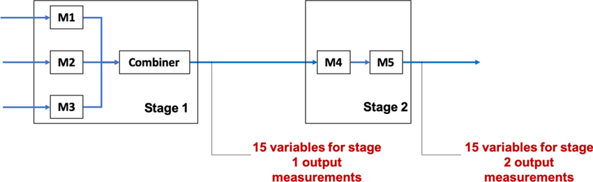

```{r setup, include=FALSE}
knitr::opts_chunk$set(echo = TRUE)
```

<br>
<br>
<br>

## [데이터 분석 개요]
### 1. 대상 데이터: 다단계 공정 데이터셋
(https://www.kaggle.com/datasets/supergus/multistage-continuousflow-manufacturing-process)

미시간 주 디트로이트 근처의 실제 생산 라인 내에서 여러 위치, 여러 생산 라인에 대하여 계측한 데이터

다양한 입력 데이터로부터 라인의 출력 특정 속성을 예측하기 위한 목적으로 수집

해당 공정 라인은 병렬 및 직렬 단계로 구성된 고속 연속 제조 공정으로, 다음과 같은 구조를 가짐

* Stage 1에서는 M1, M2, M3 기계가 병렬로 작동하며, 이들의 출력이 결합기로 전달

* 결합기에서 출력되는 Stage 1에 대한 예측치는 제작된 제품의 외부 표면을 둘러싼 15개의 위치에서 측정

* 다음으로, M4와 M5가 직렬로 처리하는 Stage 2로 이동

* M5 작동 후에는 동일한 15개의 위치에 대한 Stage 2의 측정이 이루어짐

<br>



<br>
* Oleghe, O. (2020). A predictive noise correction methodology for manufacturing process datasets. Journal of Big Data, 7(1), 89.

<br>
<br>
<br>

### 2. 분석 절차

데이터 탐색 및 전처리 / 특징 추출 및 차원 축소 / 모델 학습 및 평가 순서로 3단계로 나누어 분석 진행

2단계 공정인 관계로 Stage 1에 대한 예측모델, Stage 2에 대한 예측모델을 2단계로 모델링할 것 (이 때, Stage 2의 결과는 Stage 1에 영향을 받음)

원래 Stage 1, Stage 2에 대한 예측값은 각각 15개씩이지만, 본 강의에서는 다변량 예측을 다루지 않는 관계로 각 Stage에 대한 평균값을 종속변수로 설정

팀별로 작업을 수행하며, 작업 코드는 팀장의 Github에 Push하여 공유, 통찰력 있는 분석 기법 발굴 시 모두와 공유

가이드로 제공된 참고문헌을 바탕으로 다양한 방법론으로 분석을 수행

<br>
<br>
<br>

## [데이터 분석]
### 1. 데이터 탐색 및 전처리

* 데이터의 전반적인 분포, 특징을 파악하기 위한 기초 분석 진행

* 다양한 전처리 방법론을 활용하여 데이터를 정제
(e.g. 필요없는 변수 및 이상치/노이즈 제거 또는 보정, 표준화 등)

* 데이터 전처리 순서 (학습, 테스트셋 분할 전후)를 꼼꼼히 살펴보고 진행할 것

```{r preprocess}

dat <- read.csv("E:/Course/2024_lec_rstudio/실습/프로젝트실습/산업공학특론I_13-14주차_데이터.csv")

# timestamp 변수 삭제
dat <- dat[,-1]

# unique값 적은 변수 살펴보기
uniqval <- function(x){length(unique(x))} 
dat_uniq <- apply(dat,2,uniqval)
apply(dat[,dat_uniq<10], 2, unique) 

# setpoint 관련 변수를 면밀히 조사 
setidx <- grep('Setpoint', colnames(dat)) 

par(mfrow=c(3,5))
for (idx in setidx){
  plot(dat[,idx-1], dat[,idx], xlab=colnames(dat)[idx-1], ylab=colnames(dat)[idx])
}

apply(dat[,setidx], 2, table)
dat_set0 <- dat[dat[,setidx[1]]==0, ]
apply(dat_set0[,setidx], 2, table) # 0 제외 시 단일값 확인


# 이상치 제거 (제거 대신 다른 방법을 쓸 수도 있음)
dat <- dat[dat[,setidx[1]]!=0, ] 
apply(dat[,setidx],2,uniqval)

# Setpoint 변수 삭제
dat <- dat[,-setidx]

# 다변량 회귀분석이 아닌 관계로 종속변수 평균화
depidx1 <- grep('Stage1.Output', colnames(dat))
depidx2 <- grep('Stage2.Output', colnames(dat))
dat$Stage1_Output <- apply(dat[,depidx1],1,mean)
dat$Stage2_Output <- apply(dat[,depidx2],1,mean)
dat <- dat[,-c(depidx1,depidx2)]

# 종속변수 기반 이상치 제거/보정
library(MASS)
# outlier <- function(target){ # 방법 1) IQR
#   iqr <- quantile(target, c(0.25, 0.75))
#   (target < iqr[1] - 1.5 * diff(iqr))|(target > iqr[2] + 1.5 * diff(iqr))
# }
# outlier <- function(target){ # 방법 2) z-score 
#   z <- (target - mean(target)) / sd(target)
#   abs(z) > 3
# }
outlier <- function(target){ # 방법 3) Cook's distance
  temp <- dat[,-((ncol(dat)-1):ncol(dat))]
  temp <- cbind(temp, target)
  reg <- lm(target ~ ., data=temp)
  cd <- cooks.distance(reg)
  cd > 4 / (nrow(temp) - length(reg$coef))
} 

### 1. 이상치 제거
dat <- dat[!(outlier(dat$Stage1_Output) & outlier(dat$Stage2_Output)),]

### 2. 이상치 보정 (평균치 또는 중앙값)
dat[!(outlier(dat$Stage1_Output) & outlier(dat$Stage2_Output)),] <- apply(dat[(outlier(dat$Stage1_Output) & outlier(dat$Stage2_Output)),],2,mean)
apply(dat[(outlier(dat$Stage1_Output) & outlier(dat$Stage2_Output)),],2,median)


# 변수명 변경
colnames(dat) <- gsub('.C[.]Actual','',colnames(dat))
colnames(dat) <- gsub('.U[.]Actual','',colnames(dat))
colnames(dat) <- gsub('[.]','_',colnames(dat))
colnames(dat) <- gsub('Machine','M',colnames(dat))
colnames(dat)


# 트레인, 테스트셋 분할
library(caret)
set.seed(0)
trainidx <- sample(1:nrow(dat), 0.7*nrow(dat))
trainset <- dat[trainidx,]
testset <- dat[-trainidx,]

# 표준화
depidx <- (ncol(trainset)-1):ncol(trainset)
scaling <- preProcess(trainset[, -depidx], method = c("center", "scale"))

traintarget <- trainset[,depidx]
trainsc <- predict(scaling, trainset[, -depidx])
trainsc <- cbind(trainsc, traintarget)

testtarget <- testset[,depidx]
testsc <- predict(scaling, testset[, -depidx])
testsc <- cbind(testsc, testtarget)

# 상관분석
library(corrplot)
corr <- cor(trainsc)
col <- colorRampPalette(c('white','blue'))
corrplot(abs(corr), method='color', col=col(200), type='upper',tl.cex = 0.5, tl.col='black')

# 공정별 데이터셋 정의
### Stage1의 경우 1차 공정 변수만 활용하기 때문에 별도로 변수 추출
extract <- function(data, type){
  if (type==1){ data[,c(1:41,56)] } else if (type==2) { data[,-56] }
}

trainsc1 <- extract(trainsc,1); trainsc2 <- extract(trainsc,2)
testsc1 <- extract(testsc,1); testsc2 <- extract(testsc,2)

```

<br>

### 2. 특징 추출 및 차원 축소

* 전처리가 이루어진 데이터로부터 특성을 재정의하거나 차원 축소 기법을 적용

* 신규 변수 또는 축소된 차원으로 효과적인 예측을 수행하기 위한 방안 도출

```{r feature}

```

<br>

### 3. 모델 학습 및 평가

* Stage 1, Stage 2에 대한 예측 모델을 수립할 것

* 이 때, 각 Stage는 연결되어 있으며 Stage 2는 Stage 1의 영향을 받음

```{r modeling}

library(rpart)
library(rpart.plot)
library(caret)

#Decision Tree
train_control <- trainControl(method="cv", number=10)
rpart_control <- rpart.control(maxdepth=6, minsplit=2)
dt_grid <- expand.grid(.cp=seq(0.01,0.1,by=0.01))
dt <- train(ncap_rating ~ ., data=trainsc, method="rpart",
            trControl=train_control, control=rpart_control,
            tuneGrid=dt_grid)
rpart.plot(dt$finalModel)

library(e1071)

svm_grid <- expand.grid(.C=c(0.1,1,10), .sigma=c(0.01,0.05,0.1))

svr <- train(ncap_rating ~ ., data=trainsc, method="svmRadial",
            trControl=train_control, tuneGrid=svm_grid)

svr$finalModel


library(nnet)

mlp_gird <- expand.grid(.size=c(1,2,3), .decay=c(0,0.001,0.01))

mlp <- train(ncap_rating ~ ., data=trainsc, method="nnet",
            trControl=train_control, tuneGrid=mlp_gird,
            linout = T, trace = T)

library(NeuralNetTools)
plotnet(mlp$finalModel)

library(doParallel)
library(randomForest)


# create cluster for parallel process
cl <- makeCluster(detectCores()-1)
registerDoParallel(cl)

rf <- train(ncap_rating ~ ., data=trainsc, method="rf",
            trControl=train_control)

stopCluster(cl)
registerDoSEQ()

varImpPlot(rf$finalModel)

library(xgboost)


cl <- makeCluster(detectCores()-1)
registerDoParallel(cl)

xgb <- train(ncap_rating ~ ., data=trainsc, method="xgbTree",
            trControl=train_control)

stopCluster(cl)
registerDoSEQ()

xgbimp <- xgb.importance(model=xgb$finalModel)
xgb.plot.importance(xgbimp)

library(Metrics)

evaluate <- function(model, test){
  
  pred <- predict(model$finalModel, newdata=test)
  
  result <- c(mae(pred, testsc$ncap_rating),
              rmse(pred, testsc$ncap_rating),
              mse(pred, testsc$ncap_rating))
  
  names(result) <- c("MAE","RMSE","MSE")
  print(result)
}
print("Decision Tree")
evaluate(dt, testsc)
print("SVR")
# evaluate(svr, testsc)
print("MLP")
evaluate(mlp, testsc)
print("Random Forest")
evaluate(rf, testsc)


```
